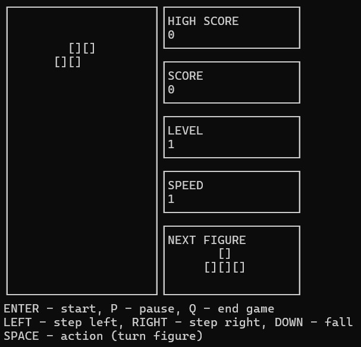

# Tetris

  

Tetris is a puzzle video game created in 1985 by Alexey Pajitnov, a Soviet software engineer. It has been published by several companies for multiple platforms, most prominently during a dispute over the appropriation of the rights in the late 1980s. After a significant period of publication by Nintendo, in 1996 the rights reverted to Pajitnov, who co-founded the Tetris Company with Henk Rogers to manage licensing.

# Main information

## Use your keyboard:

`Enter` - Start  
`P` - Pause  
`Q` - Quit  
`Left arrow` - Move left  
`Right arrow` - Move right  
`Down arrow` - falling down to the bottom  
`Spacebar` - Action (Rotation)  

## Scores

- 1 row is 100 points
- 2 rows is 300 points
- 3 rows is 700 points
- 4 rows is 1500 points

## Levels and game speed

Each time You gain 600 points, the level increases by 1.
Increasing the level boosts the speed at which the pieces move.
The maximum number of levels is 10.
